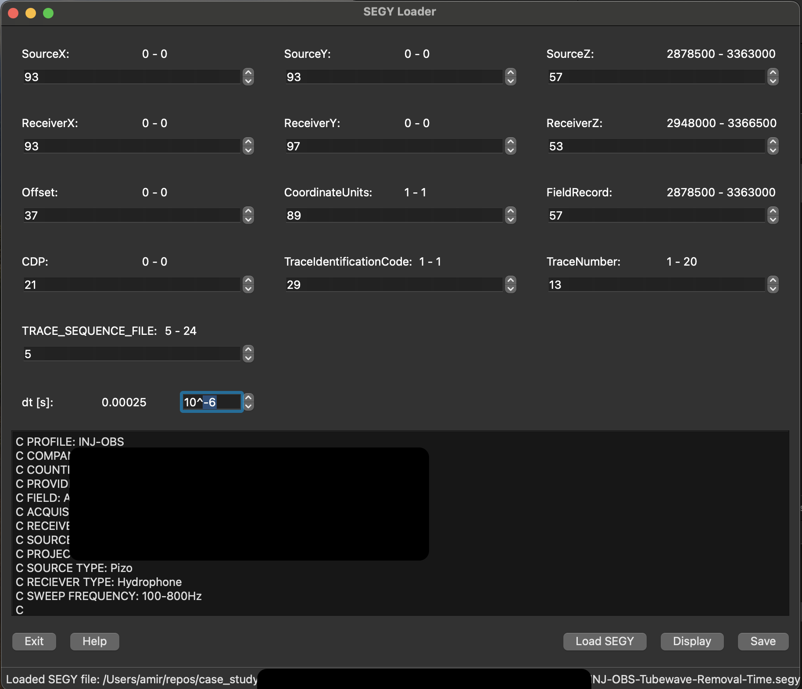

## Segy Loader
This is a package that allows me to load segy files and select the appropriate bytes for acquisition parameters and convert the data to a `h5` file. This `h5` file has a `seis` extension which can be loaded using `load_seis` (check the examples) and be manipulated easily.

- [Segy Loader](#segy-loader)
- [Load a `segy` file](#load-a-segy-file)
- [Installation](#installation)
  - [Using `pyrpoject.toml`](#using-pyrpojecttoml)
  - [Using `setup.py`](#using-setuppy)

## Load a `segy` file
```python
from path_loader import data_path  # noqa: F401
from segy_loader import load_segy

load_segy()
```


After saving as a `seis` file, it can be loaded using `segy_loader.io.load_seis` which returns a  `Seis` object with multiple functionalities.

```Python
from segy_loader.io import load_seis
path = osp.abspath(osp.join(osp.dirname(__file__), "../data/seis/42.seis"))

data = load_seis(path)
```
This only load the `seis` file, but `data` allows easy data manipulation and sorting.


Examples are available in the [Example](https://github.com/AmirMardan/segy_loader/tree/main/example) folder.

## Installation

1. Install Python 3.11.6
    ```bash
    pyenv install 3.11.6
    ```
    If you don't have `pyenv` installed, use 
    ```bash
    curl https://pyenv.run | bash
    ```
    first.

### Using `pyrpoject.toml`
2. Install `Poetry` and add it to your system's path.
   ```bash
   curl -sSL https://install.python-poetry.org | python3 -
   ```
3. Add it to your system's path
   ```bash
   echo 'export PATH="$HOME/Library/Application Support/pypoetry/venv/bin:$PATH"' >> ~/.zshrc
   ```
   You can check if it is installed using `poetry --version`
4. Create a virtual environment
   ```bash
    poetry env use python3.11.6
   ```
4. Activate the virtual environment
   ```bash
    source $(poetry env info --path)/bin/activate
   ```
5. Install requirements
   ```bash
    poetry install
   ```
6. Call `load_segy()`
   ```bash
   python -c "from segy_loader import load_segy;load_segy()" 
   ```

### Using `setup.py`

2. Create a virtual environemnt 
   ```bash
   pyenv virtualenv 3.11.6 0_segy_loader_venv
   ```
   You can check the environments using `pyenv virtualenvs` or `pyenv versions`
3. Activate the virtual environment
   ```bash
   pyenv activate 0_segy_loader_venv
   ```
4. Install requirements
   ```bash
   python -m pip install -r requirements.txt
   ```
5. Install `segy_loader`
   ```bash
   python -m pip install -e .
   ```
   or 
   ```bash
   python -m pip install git+https://github.com/AmirMardan/segy_loader.git
   ```
6. Call `load_segy()`
   ```bash
   python -c "from segy_loader import load_segy;load_segy()" 
   ```