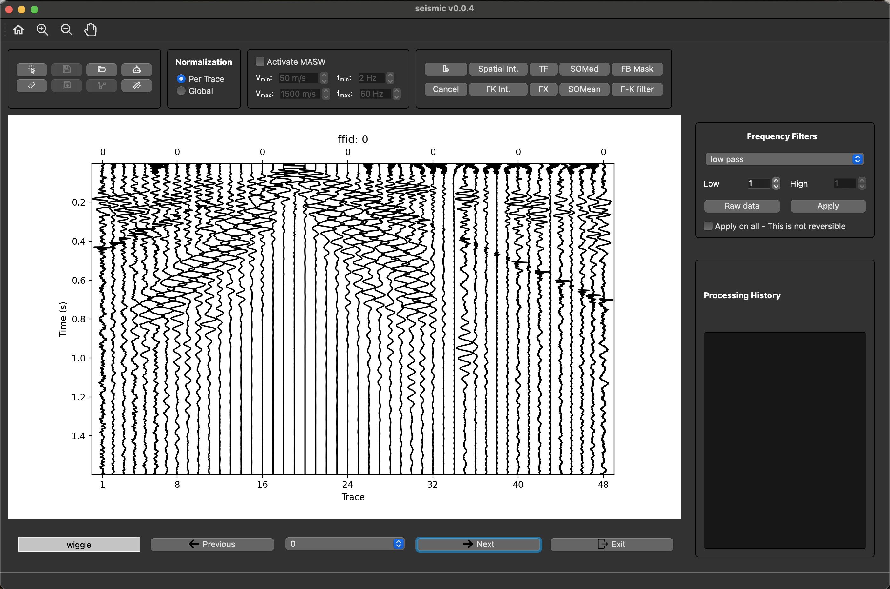

# Segy Loader

A GUI for `segyio` that allows me to load a segy file correctly by adjusting the header fields. Then the data can be saved as a `seis` file that can be loaded as a `Seis` object with multiple functionalities.

## Load a `segy` file
```python
from path_loader import data_path  # noqa: F401
from segy_loader import load_segy

load_segy()
```


After saving as a `seis` file, it can be loaded using `segy_loader.io.load_seis` which returns a  `Seis` object with multiple functionalities.

```Python
from segy_loader.io import load_seis
path = osp.abspath(osp.join(osp.dirname(__file__), "../data/seis/42.seis"))

data = load_seis(path)
```
This only load the `seis` file, but `data` allows easy data manipulation and sorting.



Examples are available in the [Example](https://github.com/AmirMardan/segy_loader/tree/main/example) folder.